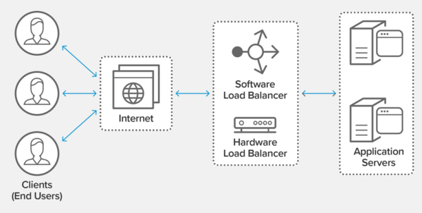
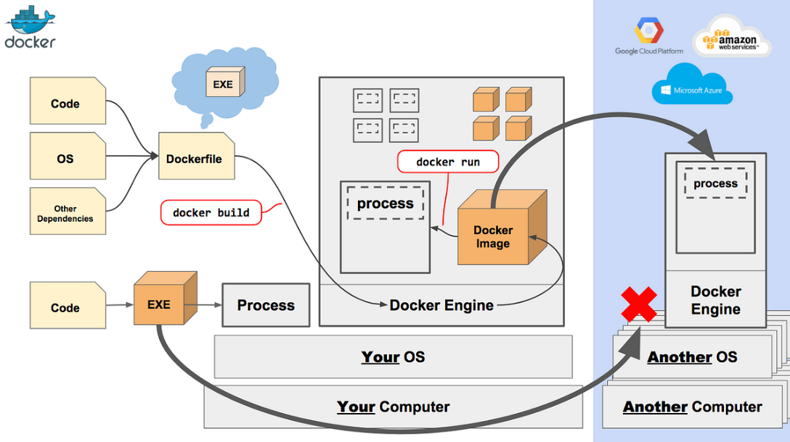

# Load Balancing and Distributed Storage

> This is a tutorial course covering load balancing, distributed storage and databases.

Tools used:

- JDK 8
- Maven
- JUnit 5, Mockito
- IntelliJ IDE
- HAProxy
- MongoDB

## Table of contents

1. [Introduction to Load Balancers](https://github.com/backstreetbrogrammer/47_LoadBalancingAndDistributedStorage?tab=readme-ov-file#chapter-01-introduction-to-load-balancers)
2. [HAProxy - Load Balancing](https://github.com/backstreetbrogrammer/47_LoadBalancingAndDistributedStorage?tab=readme-ov-file#chapter-02-haproxy---load-balancing)
    - [Configuration](https://github.com/backstreetbrogrammer/47_LoadBalancingAndDistributedStorage?tab=readme-ov-file#configuration)
    - [Docker Primer](https://github.com/backstreetbrogrammer/47_LoadBalancingAndDistributedStorage?tab=readme-ov-file#docker-primer)
    - [HAProxy Installation using Docker](https://github.com/backstreetbrogrammer/47_LoadBalancingAndDistributedStorage?tab=readme-ov-file#haproxy-installation-using-docker)
    - [HAProxy Project Setup and Run](https://github.com/backstreetbrogrammer/47_LoadBalancingAndDistributedStorage?tab=readme-ov-file#haproxy-installation-using-docker)
3. Introduction to Distributed Storage
4. Database sharding
5. MongoDB Installation
6. Scaling MongoDB

---

## Chapter 01. Introduction to Load Balancers

Load balancing refers to efficiently distributing incoming network traffic across a group of backend servers or
resources, also known as a **server farm** or **server pool**.

Modern high‑traffic websites must serve hundreds of thousands of concurrent requests from users or clients and return
the correct text, images, video, or application data, all in a fast and reliable manner.

To cost‑effectively scale to meet these high volumes, the modern computing best practice generally requires adding more
servers.



A load balancer acts as the **"traffic cop"** sitting in front of our servers and routing client requests across all
servers capable of fulfilling those requests in a manner that maximizes speed and capacity utilization.

It ensures that no one server is overworked, which could degrade performance.

If a single server goes down, the load balancer redirects traffic to the remaining online servers.

When a new server is added to the server group, the load balancer automatically starts to send requests to it.

In this manner, a load balancer performs the following functions:

- Distributes client requests or network load efficiently across multiple servers
- Ensures high availability and reliability by sending requests only to servers that are online
- Provides the flexibility to add or subtract servers as demand dictates

**_Types of Load Balancers_**

- Hardware Load Balancers: dedicated hardware devices designed and optimized for the load balancing
    - High performance
    - Can balance the load to larger number of servers
    - More reliable
- Software Load Balancers: load balancing software
    - Easy to configure, upgrade, update or troubleshoot
    - Cheaper and more cost-effective
    - Open source solutions are available (HAProxy, Nginx)

**_Load Balancing Algorithms_**

Different load balancing algorithms provide different benefits; the choice of load balancing method depends on our
needs:

- **Round Robin** – Requests are distributed across the group of servers _**sequentially**_.
- **Least Connections** – A new request is sent to the server with the **fewest** current connections to clients. The
  relative computing capacity of each server is factored into determining which one has the least number of connections.
- **Least Time** – Sends requests to the server selected by a formula that combines the fastest response time and the
  fewest active connections.
- **Hash** – Distributes requests based on a **key** we define, such as the client IP address or the request URL.
  Can optionally apply a **consistent hash** to minimize redistribution of loads if the set of upstream servers changes.
  Consistent hashing is a special kind of hashing technique such that when a hash table is resized, only `n/m` keys need
  to be remapped on average where `n` is the number of keys and `m` is the number of slots. In contrast, in most
  traditional hash tables, a change in the number of array slots causes nearly all keys to be remapped because the
  mapping between the keys and the slots is defined by a modular operation.
- **Ring hashing** – This algorithm maps both clients and servers onto a ring structure, with each server assigned
  multiple points on the ring based on its capacity. When a client request comes in, it is hashed to a point on the
  ring, and is then dynamically routed clockwise to the next available server.
- **IP Hash** – The IP address of the client is used to determine which server receives the request.
- **Random with Two Choices** – Picks two servers at random and sends the request to the one that is selected by then
  applying the Least Connections algorithm or the Least Time algorithm.

**_Load Balancing Layers_**

- **Transport layer** load balancing: Layer 4 in the OSI model
    - performs simple TCP packets forwarding between the client and the backend servers
    - does not inspect the content of the TCP stream beyond the first few packets, thus having low overhead
- **Application layer** load balancing: Layer 7 in the OSI model
    - can make smarter routing decisions based on the HTTP **headers**
    - inspects TCP packets and HTTP header
    - can route requests to different cluster of servers based on:
        - request URL
        - type of requested data
        - HTTP method
        - browser cookies

---

## Chapter 02. HAProxy - Load Balancing

**HAProxy** is a reliable, high-performance TCP / HTTP load balancer.

### Configuration

HAProxy's logic comes from a config file: `haproxy.cfg`

- predefined location: `/usr/local/etc/haproxy/haproxy.cfg`
- command line: `haproxy -f haproxy.cfg`

Configuration file structure:

- `global` section: parameters for the entire load balancing process (OS specific)
- Proxies section: parameters for proxying incoming traffic to our backend cluster
    - `default`: optional parameters for all proxies
    - `frontend`: how to handle incoming traffic
    - `backend`: servers to proxy the incoming traffic
    - `listen`: optional frontend + backend

Sample `haproxy.cfg` file we will be using:

```
global
    maxconn 500

defaults
    mode http
    timeout connect 10s
    timeout client  50s
    timeout server  50s

frontend http-in
    bind *:80
    default_backend application_nodes

backend application_nodes
    balance roundrobin
    option httpchk GET /status
    http-check expect string "Server is alive"
    server server01 app1:9001 check inter 1s
    server server02 app2:9002 check inter 2s
    server server03 app3:9003 check inter 2s

listen stats 
    bind *:83
    stats enable
    stats uri /
```

### Docker Primer

Docker is a set of platform as a service (**PaaS**) products that use OS-level virtualization to deliver software in
packages called **containers**.

The software that hosts the containers is called **Docker Engine**.



It allows users to create independent and isolated environments to launch and deploy their applications. These
environments are then called **containers**.

This will let the developer run a container on any machine.

With Docker, there are no more dependency or compilation problems.

All we have to do is launch our container and our application will launch immediately.

**Docker vs Virtual Machine**

Unlike Docker, a virtual machine will include a complete operating system. It will work independently and act like a
computer.

Docker will only share the resources of the host machine to run its environments.


**Key points:**

- Docker is **fast**. Unlike a virtual machine, our application can start in a few seconds and stop just as quickly.
- Docker is **multi-platform**. We can launch our container on any system.
- Containers can be built and destroyed **faster** than a virtual machine.
- No more difficulties setting up our working environment.
  Once our Docker is configured, we will never have to reinstall our dependencies manually again.
  If we change computers or if an employee joins our company, we only have to give them our configuration.
- We keep our work-space **clean**, as each of our environments will be **isolated**, and we can delete them at any time
  without impacting the rest.
- It will be **easier** to deploy our project on our server to put it online.

**_Step-by-step guide for a simple application_**:

- Install Docker:
    - [Installing Docker on Windows](https://docs.docker.com/desktop/install/windows-install/)
    - [Installing Docker on MacOS](https://docs.docker.com/desktop/install/mac-install/)
    - [Installing Docker on Linux](https://docs.docker.com/desktop/install/linux-install/)
- Create a folder on computer. It must contain the following two files:

A `main.py` file (python file that will contain the code to be executed).
A `Dockerfile` file (Docker file that will contain the necessary instructions to create the environment).

`main.py` may have the following content:

```
#!/usr/bin/env python3

print("Hello Guidemy Students!")
```

- Edit the `Dockerfile` file

Our goal here is to launch Python code.

To do this, our Docker must contain all the dependencies necessary to launch Python. A linux (Ubuntu) with Python
installed on it should be enough.

The first step to take when we create a Docker file is to access the [DockerHub website](https://hub.docker.com/).

This site contains many pre-designed images to save our time (for example, all images for linux or code languages).

In our case, we will type **"Python"** in the search bar. The first result is the official image created to execute
Python.

```
# A dockerfile must always start by importing the base image.
# We use the keyword 'FROM' to do that.
# In our example, we want import the python image.
# So we write 'python' for the image name and 'latest' for the version.
FROM python:latest

# In order to launch our python code, we must import it into our image.
# We use the keyword 'COPY' to do that.
# The first parameter 'main.py' is the name of the file on the host.
# The second parameter '/' is the path where to put the file on the image.
# Here we put the file at the image root folder.
COPY main.py /

# We need to define the command to launch when we are going to run the image.
# We use the keyword 'CMD' to do that.
# The following command will execute "python ./main.py".
CMD [ "python", "./main.py" ]
```

- Create the Docker image

Once our code is ready and the `Dockerfile` is written, all we have to do is create our docker **image** to contain our
application.

```
docker build -t python-test .
```

The `-t` option allows us to define the name of our docker image.

- Run the Docker image

```
docker run python-test
```

Our docker container should be running now and will print the message: `Hello Guidemy Students!`

Here is a list of useful commands for Docker:

- List your images.

`$ docker image ls`

- Delete a specific image.

`$ docker image rm [image name]`

- Delete all existing images.

`$ docker image rm $(docker images -a -q)`

- List all existing containers (running and not running).

`$ docker ps -a`

- Stop a specific container.

`$ docker stop [container name]`

- Stop all running containers.

`$ docker stop $(docker ps -a -q)`

- Delete a specific container (only if stopped).

`$ docker rm [container name]`

- Delete all containers (only if stopped).

`$ docker rm $(docker ps -a -q)`

- Display logs of a container.

`$ docker logs [container name]`

### HAProxy Installation using Docker

For our HAProxy demo app, we need to remember only two commands:

- Start services: `docker-compose up --build`
- Stop services: `docker-compose down`

**_Install Docker in Ubuntu on WSL2_**

- Set up Docker's apt repository

```
# Add Docker's official GPG key:
sudo apt-get update
sudo apt-get install ca-certificates curl
sudo install -m 0755 -d /etc/apt/keyrings
sudo curl -fsSL https://download.docker.com/linux/ubuntu/gpg -o /etc/apt/keyrings/docker.asc
sudo chmod a+r /etc/apt/keyrings/docker.asc
```

```
# Add the repository to Apt sources:
echo \
"deb [arch=$(dpkg --print-architecture) signed-by=/etc/apt/keyrings/docker.asc] https://download.docker.com/linux/ubuntu \
$(. /etc/os-release && echo "$VERSION_CODENAME") stable" | \
sudo tee /etc/apt/sources.list.d/docker.list > /dev/null
sudo apt-get update
```

- Install the Docker packages

```
sudo apt-get install docker-ce docker-ce-cli containerd.io docker-buildx-plugin docker-compose-plugin
```

- Configuring Docker on WSL2

    - Using Docker Without Invoking Root

```
sudo groupadd docker
sudo usermod -aG docker $USER

# restart Ubunutu

# verify installation
docker run hello-world
```

- Starting the Docker Daemon

```
# add following in "~/.profile"

if [ -n "`service docker status | grep Stopped`" ]; then
    sudo /usr/sbin/service docker start
fi
```

- Fix asking root password at startup by running below commands:

```
# replace username with actual username of Ubuntu:

sudo visudo -f /etc/sudoers.d/passwordless_docker_start

username        ALL = (root) NOPASSWD: /usr/sbin/service docker start

# save and exit the file:
^S and then ^X
```

### HAProxy Project Setup and Run

- Open the Ubuntu app
- 


