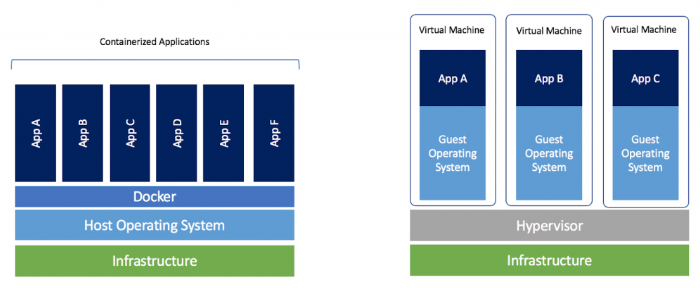

# Load Balancing and Distributed Storage

> This is a tutorial course covering load balancing, distributed storage and database sharding.

Tools used:

- JDK 11
- Maven
- JUnit 5, Mockito
- IntelliJ IDE
- HAProxy
- MongoDB

## Table of contents

1. [Introduction to Load Balancers](https://github.com/backstreetbrogrammer/47_LoadBalancingAndDistributedStorage?tab=readme-ov-file#chapter-01-introduction-to-load-balancers)
2. [HAProxy - Load Balancing](https://github.com/backstreetbrogrammer/47_LoadBalancingAndDistributedStorage?tab=readme-ov-file#chapter-02-haproxy---load-balancing)
    - [Configuration](https://github.com/backstreetbrogrammer/47_LoadBalancingAndDistributedStorage?tab=readme-ov-file#configuration)
    - [Docker Primer](https://github.com/backstreetbrogrammer/47_LoadBalancingAndDistributedStorage?tab=readme-ov-file#docker-primer)
    - [HAProxy Installation using Docker](https://github.com/backstreetbrogrammer/47_LoadBalancingAndDistributedStorage?tab=readme-ov-file#haproxy-installation-using-docker)
    - [HAProxy Project Setup and Run](https://github.com/backstreetbrogrammer/47_LoadBalancingAndDistributedStorage?tab=readme-ov-file#haproxy-project-setup-and-run)
3. [Distributed Storage and Database Sharding](https://github.com/backstreetbrogrammer/47_LoadBalancingAndDistributedStorage?tab=readme-ov-file#chapter-03-distributed-storage-and-database-sharding)
    - [Database Sharding Overview](https://github.com/backstreetbrogrammer/47_LoadBalancingAndDistributedStorage?tab=readme-ov-file#database-sharding-overview)
    - [Dynamic Sharding with Consistent Hashing](https://github.com/backstreetbrogrammer/47_LoadBalancingAndDistributedStorage?tab=readme-ov-file#database-sharding-overview)

---

## Chapter 01. Introduction to Load Balancers

Load balancing refers to efficiently distributing incoming network traffic across a group of backend servers or
resources, also known as a **server farm** or **server pool**.

Modern high‑traffic websites must serve hundreds of thousands of concurrent requests from users or clients and return
the correct text, images, video, or application data, all in a fast and reliable manner.

To cost‑effectively scale to meet these high volumes, the modern computing best practice generally requires adding more
servers.


A load balancer acts as the **"traffic cop"** sitting in front of our servers and routing client requests across all
servers capable of fulfilling those requests in a manner that maximizes speed and capacity utilization.

It ensures that no one server is overworked, which could degrade performance.

If a single server goes down, the load balancer redirects traffic to the remaining online servers.

When a new server is added to the server group, the load balancer automatically starts to send requests to it.

In this manner, a load balancer performs the following functions:

- Distributes client requests or network load efficiently across multiple servers
- Ensures high availability and reliability by sending requests only to servers that are online
- Provides the flexibility to add or subtract servers as demand dictates

**_Types of Load Balancers_**

- Hardware Load Balancers: dedicated hardware devices designed and optimized for the load balancing
    - High performance
    - Can balance the load to larger number of servers
    - More reliable
- Software Load Balancers: load balancing software
    - Easy to configure, upgrade, update or troubleshoot
    - Cheaper and more cost-effective
    - Open source solutions are available (HAProxy, Nginx)

**_Load Balancing Algorithms_**

Different load balancing algorithms provide different benefits; the choice of load balancing method depends on our
needs:

- **Round Robin** – Requests are distributed across the group of servers _**sequentially**_.
- **Least Connections** – A new request is sent to the server with the **fewest** current connections to clients. The
  relative computing capacity of each server is factored into determining which one has the least number of connections.
- **Least Time** – Sends requests to the server selected by a formula that combines the fastest response time and the
  fewest active connections.
- **Hash** – Distributes requests based on a **key** we define, such as the client IP address or the request URL.
  Can optionally apply a **consistent hash** to minimize redistribution of loads if the set of upstream servers changes.
  Consistent hashing is a special kind of hashing technique such that when a hash table is resized, only `n/m` keys need
  to be remapped on average where `n` is the number of keys and `m` is the number of slots. In contrast, in most
  traditional hash tables, a change in the number of array slots causes nearly all keys to be remapped because the
  mapping between the keys and the slots is defined by a modular operation.
- **Ring hashing** – This algorithm maps both clients and servers onto a ring structure, with each server assigned
  multiple points on the ring based on its capacity. When a client request comes in, it is hashed to a point on the
  ring, and is then dynamically routed clockwise to the next available server.
- **IP Hash** – The IP address of the client is used to determine which server receives the request.
- **Random with Two Choices** – Picks two servers at random and sends the request to the one that is selected by then
  applying the Least Connections algorithm or the Least Time algorithm.

**_Load Balancing Layers_**

- **Transport layer** load balancing: Layer 4 in the OSI model
    - performs simple TCP packets forwarding between the client and the backend servers
    - does not inspect the content of the TCP stream beyond the first few packets, thus having low overhead
- **Application layer** load balancing: Layer 7 in the OSI model
    - can make smarter routing decisions based on the HTTP **headers**
    - inspects TCP packets and HTTP header
    - can route requests to different cluster of servers based on:
        - request URL
        - type of requested data
        - HTTP method
        - browser cookies

---

## Chapter 02. HAProxy - Load Balancing

**HAProxy** is a reliable, high-performance TCP / HTTP load balancer.

### Configuration

HAProxy's logic comes from a config file: `haproxy.cfg`

- predefined location: `/usr/local/etc/haproxy/haproxy.cfg`
- command line: `haproxy -f haproxy.cfg`

Configuration file structure:

- `global` section: parameters for the entire load balancing process (OS specific)
- Proxies section: parameters for proxying incoming traffic to our backend cluster
    - `default`: optional parameters for all proxies
    - `frontend`: how to handle incoming traffic
    - `backend`: servers to proxy the incoming traffic
    - `listen`: optional frontend + backend

Sample `haproxy.cfg` file we will be using:

```
global
    maxconn 500

defaults
    mode http
    timeout connect 10s
    timeout client  50s
    timeout server  50s

frontend http-in
    bind *:80
    default_backend application_nodes

backend application_nodes
    balance roundrobin
    option httpchk GET /status
    http-check expect string "Server is alive"
    server server01 app1:9001 check inter 1s
    server server02 app2:9002 check inter 2s
    server server03 app3:9003 check inter 2s

listen stats 
    bind *:83
    stats enable
    stats uri /
```

### Docker Primer

Docker is a set of platform as a service (**PaaS**) products that use OS-level virtualization to deliver software in
packages called **containers**.

The software that hosts the containers is called **Docker Engine**.


It allows users to create independent and isolated environments to launch and deploy their applications. These
environments are then called **containers**.

This will let the developer run a container on any machine.

With Docker, there are no more dependency or compilation problems.

All we have to do is launch our container and our application will launch immediately.

**Docker vs Virtual Machine**

Unlike Docker, a virtual machine will include a complete operating system. It will work independently and act like a
computer.

Docker will only share the resources of the host machine to run its environments.



**Key points:**

- Docker is **fast**. Unlike a virtual machine, our application can start in a few seconds and stop just as quickly.
- Docker is **multi-platform**. We can launch our container on any system.
- Containers can be built and destroyed **faster** than a virtual machine.
- No more difficulties setting up our working environment.
  Once our Docker is configured, we will never have to reinstall our dependencies manually again.
  If we change computers or if an employee joins our company, we only have to give them our configuration.
- We keep our work-space **clean**, as each of our environments will be **isolated**, and we can delete them at any time
  without impacting the rest.
- It will be **easier** to deploy our project on our server to put it online.

**_Step-by-step guide for a simple application_**:

- Install Docker:
    - [Installing Docker on Windows](https://docs.docker.com/desktop/install/windows-install/)
    - [Installing Docker on MacOS](https://docs.docker.com/desktop/install/mac-install/)
    - [Installing Docker on Linux](https://docs.docker.com/desktop/install/linux-install/)
- Create a folder on computer. It must contain the following two files:

A `main.py` file (python file that will contain the code to be executed).
A `Dockerfile` file (Docker file that will contain the necessary instructions to create the environment).

`main.py` may have the following content:

```
#!/usr/bin/env python3

print("Hello Guidemy Students!")
```

- Edit the `Dockerfile` file

Our goal here is to launch Python code.

To do this, our Docker must contain all the dependencies necessary to launch Python. A linux (Ubuntu) with Python
installed on it should be enough.

The first step to take when we create a Docker file is to access the [DockerHub website](https://hub.docker.com/).

This site contains many pre-designed images to save our time (for example, all images for linux or code languages).

In our case, we will type **"Python"** in the search bar. The first result is the official image created to execute
Python.

```
# A dockerfile must always start by importing the base image.
# We use the keyword 'FROM' to do that.
# In our example, we want import the python image.
# So we write 'python' for the image name and 'latest' for the version.
FROM python:latest

# In order to launch our python code, we must import it into our image.
# We use the keyword 'COPY' to do that.
# The first parameter 'main.py' is the name of the file on the host.
# The second parameter '/' is the path where to put the file on the image.
# Here we put the file at the image root folder.
COPY main.py /

# We need to define the command to launch when we are going to run the image.
# We use the keyword 'CMD' to do that.
# The following command will execute "python ./main.py".
CMD [ "python", "./main.py" ]
```

- Create the Docker image

Once our code is ready and the `Dockerfile` is written, all we have to do is create our docker **image** to contain our
application.

```
docker build -t python-test .
```

The `-t` option allows us to define the name of our docker image.

- Run the Docker image

```
docker run python-test
```

Our docker container should be running now and will print the message: `Hello Guidemy Students!`

Here is a list of useful commands for Docker:

- List your images.

`$ docker image ls`

- Delete a specific image.

`$ docker image rm [image name]`

- Delete all existing images.

`$ docker image rm $(docker images -a -q)`

- List all existing containers (running and not running).

`$ docker ps -a`

- Stop a specific container.

`$ docker stop [container name]`

- Stop all running containers.

`$ docker stop $(docker ps -a -q)`

- Delete a specific container (only if stopped).

`$ docker rm [container name]`

- Delete all containers (only if stopped).

`$ docker rm $(docker ps -a -q)`

- Display logs of a container.

`$ docker logs [container name]`

### HAProxy Installation using Docker

For our HAProxy demo app, we need to remember only two commands:

- Start services: `docker-compose up --build`
- Stop services: `docker-compose down`

**_Install Docker in Ubuntu on WSL2_**

- Set up Docker's apt repository

```
# Add Docker's official GPG key:
sudo apt-get update
sudo apt-get install ca-certificates curl
sudo install -m 0755 -d /etc/apt/keyrings
sudo curl -fsSL https://download.docker.com/linux/ubuntu/gpg -o /etc/apt/keyrings/docker.asc
sudo chmod a+r /etc/apt/keyrings/docker.asc
```

```
# Add the repository to Apt sources:
echo \
"deb [arch=$(dpkg --print-architecture) signed-by=/etc/apt/keyrings/docker.asc] https://download.docker.com/linux/ubuntu \
$(. /etc/os-release && echo "$VERSION_CODENAME") stable" | \
sudo tee /etc/apt/sources.list.d/docker.list > /dev/null
sudo apt-get update
```

- Install the Docker packages

```
sudo apt-get install docker-ce docker-ce-cli containerd.io docker-buildx-plugin docker-compose-plugin
```

- Configuring Docker on WSL2

    - Using Docker Without Invoking Root

```
sudo groupadd docker
sudo usermod -aG docker $USER

# restart Ubunutu

# verify installation
docker run hello-world
```

- Starting the Docker Daemon

```
# add following in "~/.profile"

if [ -n "`service docker status | grep Stopped`" ]; then
    sudo /usr/sbin/service docker start
fi
```

- Fix asking root password at startup by running below commands:

```
# replace username with actual username of Ubuntu:

sudo visudo -f /etc/sudoers.d/passwordless_docker_start

username        ALL = (root) NOPASSWD: /usr/sbin/service docker start

# save and exit the file:
^S and then ^X
```

### HAProxy Project Setup and Run

- Open the Ubuntu app
- Create a directory: `mkdir haproxy_demo`
- Do the following project setup:

```
cd haproxy_demo
mkdir haproxy webapp

# create a new file: docker-compose.yml
vi docker-compose.yml
```

`docker-compose.yml`

```
version: '3.4'

services:
  app1:
    build: ./webapp 
    container_name: app1
    command: 9001 "Server 1"
    ports: 
      - "9001:9001"

  app2:
    build: ./webapp
    container_name: app2
    command: 9002 "Server 2"
    ports: 
      - "9002:9002"

  app3:
    build: ./webapp
    container_name: app3
    command: 9003 "Server 3"
    ports: 
      - "9003:9003"

  haproxy:
    build: ./haproxy
    container_name: haproxy
    ports:
      - "80:80"
      - "83:83"

```

- Setup **haproxy**

```
cd haproxy

# create 4 files as given:
dockerfile  
haproxy.cfg  
haproxy_routing.cfg  
haproxy_tcp_mode.cfg
```

`dockerfile`

```
FROM haproxy:1.7
COPY haproxy.cfg /usr/local/etc/haproxy/haproxy.cfg
ENTRYPOINT ["haproxy", "-f", "/usr/local/etc/haproxy/haproxy.cfg"]
```

`haproxy.cfg`

```
global
    maxconn 500

defaults
    mode http
    timeout connect 10s
    timeout client  50s
    timeout server  50s

frontend http-in
    bind *:80
    default_backend application_nodes

backend application_nodes
    balance roundrobin
    option httpchk GET /status
    http-check expect string "Server is alive"
    server server01 app1:9001 check inter 1s
    server server02 app2:9002 check inter 2s
    server server03 app3:9003 check inter 2s

listen stats 
    bind *:83
    stats enable
    stats uri /

```

`haproxy_routing.cfg`

```
global

defaults
    mode http
    timeout connect 5000
    timeout client  50000
    timeout server  50000


frontend http-in
    bind *:80
    acl even_cluster path_end -i /even
    acl odd_cluster path_end -i /odd
    
    use_backend even_servers if even_cluster
    use_backend odd_servers if odd_cluster

backend even_servers
    balance roundrobin
    server server02 app2:9002/time check

backend odd_servers
    balance roundrobin
    server server01 app1:9001/time check
    server server03 app3:9003/time check

```

`haproxy_tcp_mode.cfg`

```
global

defaults
    mode tcp
    timeout connect 5000
    timeout client  50000
    timeout server  50000

frontend http-in
    bind *:80
    default_backend application_nodes

backend application_nodes
    balance roundrobin
    server server01 app1:9001 check
    server server02 app2:9002 check
    server server03 app3:9003 check

```

- Setup `webapp` Java project

```
cd webapp
mkdir -p src/main/java
mkdir -p src/main/resources
mkdir -p src/test/java
mkdir target

# create 2 files as given:
dockerfile
pom.xml
```

`dockerfile`

```
FROM maven:3.6.1-jdk-11 AS MAVEN_TOOL_CHAIN_CONTAINER
RUN mkdir src
COPY src /tmp/src
COPY ./pom.xml /tmp/
WORKDIR /tmp/
RUN mvn package
RUN ls -la /tmp

FROM openjdk:11
COPY --from=MAVEN_TOOL_CHAIN_CONTAINER /tmp/target/webapp-1.0-SNAPSHOT-jar-with-dependencies.jar /tmp/
WORKDIR /tmp/
ENTRYPOINT ["java","-jar", "webapp-1.0-SNAPSHOT-jar-with-dependencies.jar"]
CMD ["80", "Server Name"]
```

`pom.xml`

```xml
<?xml version="1.0" encoding="UTF-8"?>

<project xmlns="http://maven.apache.org/POM/4.0.0"
         xmlns:xsi="http://www.w3.org/2001/XMLSchema-instance"
         xsi:schemaLocation="http://maven.apache.org/POM/4.0.0 http://maven.apache.org/xsd/maven-4.0.0.xsd">
    <modelVersion>4.0.0</modelVersion>

    <groupId>distributed.systems</groupId>
    <artifactId>webapp</artifactId>
    <version>1.0-SNAPSHOT</version>

    <build>
        <plugins>
            <plugin>
                <groupId>org.apache.maven.plugins</groupId>
                <artifactId>maven-compiler-plugin</artifactId>
                <version>3.8.0</version>
                <configuration>
                    <release>11</release>
                </configuration>
            </plugin>

            <plugin>
                <artifactId>maven-assembly-plugin</artifactId>
                <executions>
                    <execution>
                        <phase>package</phase>
                        <goals>
                            <goal>single</goal>
                        </goals>
                    </execution>
                </executions>
                <configuration>
                    <archive>
                        <manifest>
                            <mainClass>Application</mainClass>
                        </manifest>
                    </archive>
                    <descriptorRefs>
                        <descriptorRef>jar-with-dependencies</descriptorRef>
                    </descriptorRefs>
                </configuration>
            </plugin>

        </plugins>

    </build>

    <dependencies>

        <dependency>
            <groupId>org.jsoup</groupId>
            <artifactId>jsoup</artifactId>
            <version>1.12.1</version>
        </dependency>

    </dependencies>


</project>
```

```
cd src/main/resources/

# create index.html
```

`index.html`

```html
<!DOCTYPE html>
<html>
<head>
    <title>Distributed Search</title>
    <meta http-equiv="cache-control" content="no-cache"/>
</head>
<body style="background: #e6f3ff;">
<h1 style="color:blue; text-align: center; font-style: bold" id="server_name_title">Welcome to </h1>
<h1 style="color:#00b4ff; text-align: center; font-style: italic" id="server_name"></h1>
</body>
</html>
```

```
cd src/main/java/

# create 2 Java files:

WebServer
Application
```

`WebServer`

```java
import com.sun.net.httpserver.HttpExchange;
import com.sun.net.httpserver.HttpServer;
import org.jsoup.Jsoup;
import org.jsoup.nodes.Document;
import org.jsoup.nodes.Element;

import java.io.IOException;
import java.io.InputStream;
import java.io.OutputStream;
import java.net.InetSocketAddress;
import java.nio.charset.StandardCharsets;
import java.util.concurrent.Executors;

public class WebServer {

    private static final String STATUS_ENDPOINT = "/status";
    private static final String HOME_PAGE_ENDPOINT = "/";

    private static final String HTML_PAGE = "index.html";

    private final int port;
    private final String serverName;

    public WebServer(final int port, final String serverName) {
        this.port = port;
        this.serverName = serverName;
    }

    public void startServer() {
        final HttpServer server;
        try {
            server = HttpServer.create(new InetSocketAddress(port), 0);
        } catch (final IOException e) {
            System.err.println(e.getMessage());
            return;
        }

        server.createContext(STATUS_ENDPOINT, this::handleStatusCheckRequest);
        server.createContext(HOME_PAGE_ENDPOINT, this::handleHomePageRequest);

        server.setExecutor(Executors.newFixedThreadPool(8));
        System.out.printf("Started server %s on port %d %n", serverName, port);
        server.start();
    }

    private void handleHomePageRequest(final HttpExchange exchange) throws IOException {
        if (!exchange.getRequestMethod().equalsIgnoreCase("get")) {
            exchange.close();
            return;
        }

        System.out.printf("%s received a request%n", this.serverName);
        exchange.getResponseHeaders().add("Content-Type", "text/html");
        exchange.getResponseHeaders().add("Cache-Control", "no-cache");

        final byte[] response = loadHtml();

        sendResponse(response, exchange);
    }

    /**
     * Loads the HTML page to be fetched to the web browser
     */
    private byte[] loadHtml() throws IOException {
        final InputStream htmlInputStream = getClass().getResourceAsStream(WebServer.HTML_PAGE);
        if (htmlInputStream == null) {
            return new byte[]{};
        }

        final Document document = Jsoup.parse(htmlInputStream, StandardCharsets.UTF_8.name(), "");

        final String modifiedHtml = modifyHtmlDocument(document);
        return modifiedHtml.getBytes();
    }

    /**
     * Fills the server's name and local time in theHTML document
     *
     * @param document - original HTML document
     */
    private String modifyHtmlDocument(final Document document) {
        final Element serverNameElement = document.selectFirst("#server_name");
        serverNameElement.appendText(serverName);
        return document.toString();
    }

    private void handleStatusCheckRequest(final HttpExchange exchange) throws IOException {
        if (!exchange.getRequestMethod().equalsIgnoreCase("get")) {
            exchange.close();
            return;
        }

        System.out.println("Received a health check");
        final String responseMessage = String.format("Server is alive%n");
        sendResponse(responseMessage.getBytes(), exchange);
    }

    private void sendResponse(final byte[] responseBytes, final HttpExchange exchange) throws IOException {
        exchange.sendResponseHeaders(200, responseBytes.length);
        final OutputStream outputStream = exchange.getResponseBody();
        outputStream.write(responseBytes);
        outputStream.flush();
        outputStream.close();
    }

}
```

`Application`

```java
public class Application {

    public static void main(final String[] args) {
        if (args.length != 2) {
            System.out.println("java -jar (jar name) PORT_NUMBER SERVER_NAME");
        }
        final int currentServerPort = Integer.parseInt(args[0]);
        final String serverName = args[1];

        final WebServer webServer = new WebServer(currentServerPort, serverName);

        webServer.startServer();
    }

}
```

Now all our projects are set up, let's build and run.

Build Java Project:

```
cd ~/haproxy_demo/webapp
mvn clean install

# this will build the target folder jars
```

Create Docker images and run the containers:

```
# install docker-compose first by running this command:
sudo apt  install docker-compose

# build and run
cd ~/haproxy_demo/
docker-compose up --build
```

Now our containers are running with `app1`, `app2`, `app3` (webapps) along with `haproxy` as load balancer.

- Launch a browser: `localhost:83`
- This will show: `Statistics Report for HAProxy`
- Now we can launch: `localhost`
- This will show: `Welcome to Server n`
- `n` is the server load balanced by `HAProxy` - it can be 1, 2 or 3
- Refreshing the browser will keep on giving new server in round-robin fashion

We can stop the application by first running `Ctrl-C` and then running the command: `docker-compose down`

---

## Chapter 03. Distributed Storage and Database Sharding

> Distributed storage is a method of storing data across multiple nodes, typically in a network of interconnected
> computers.

As a result, the data is readily available, scalable, and resilient against failures.

Unlike traditional storage systems, distributed storage spreads data across multiple locations.

This decentralization reduces the risk of data loss, improves access speed, and lowers costs.

This method departs from traditional storage methods, where data is stored in a central location.

However, the unprecedented growth of data and with the explosion of digital content, traditional storage methods
struggle to keep up.

They're not just falling short in terms of capacity but also in terms of speed, security, and reliability.

That's where distributed storage comes in, offering a more robust, scalable, and secure solution for data storage.

**_Database vs File System_**

A **File System** is:

- a lower level, general purpose approach to storage of data of any format, structure or size
- best for unstructured data, or data with no relationship to other data
- examples: video file, audio file, text file, memory logs

A `Database` is:

- an application which is a higher level abstraction that provides additional capabilities (query language/engine),
  caching and performance optimizations
- provides restrictions on structure, relationship and format
- guarantees **ACID** transactions: Atomicity, Consistency, Isolation, Durability

**_Types of Databases_**

There are two types of databases:

- Relational Databases (SQL): Data is structured as tables (rows and columns)
- Non-Relational Databases (NoSQL): Less structured data
    - Key/Value pairs
    - Key/Document pairs
    - Graph Databases

**_Centralized Database_**

We want our database to provide availability, scalability and fault tolerance.

A **centralized** database cannot achieve these characteristics as it has a **single point of failure**:

- losing a database is a lot worse than losing a compute node
- temporary failure to operate the business
- permanently losing our data
- compute nodes can easily be restored
- permanent data loss can be detrimental to the business

Performance Bottleneck:

- parallelism is limited to the number of cores in a machine
- limited connections the OS and network card can support
- minimum latency depends on the geographical location of the database instance and the user
- limited to the memory a single machine can have

### Database Sharding Overview

- **Sharding**: partitioning a large dataset into multiple smaller chunks of data called **shards**
- Using sharding, we can split a large datasets into smaller pieces living on different machines


Sharding is a database architecture pattern related to **horizontal partitioning** — the practice of separating one
table's rows into multiple different tables, known as **partitions**.

Each partition has the same schema and columns, but also entirely different rows. Likewise, the data held in each is
unique and independent of the data held in other partitions.

In a **vertically-partitioned** table, entire columns are separated out and put into new, distinct tables.

The data held within one vertical partition is independent of the data in all the others, and each holds both distinct
rows and columns.

**_Key-Based Sharding_**


- Sharding is done based on the record's key
- The key determines in which shard
    - to find an existing record
    - to add a new record with a new key

**_Range-Based Sharding_**


- We divide the keyspace into multiple contiguous range
- Records with nearby keys will more likely end up in the same shard
- Range-based queries will be a lot more efficient

**_Directory-Based Sharding_**


- Use a lookup table to match database information to the corresponding physical shard
- A lookup table is like a table on a spreadsheet that links a database column to a shard key

### Dynamic Sharding with Consistent Hashing

Let's take an example where we have four shards of our database.

Any record is stored in a particular shard based on the formula: `Hash(Key) mod 4`

Now suppose we want to add one more shard => then we need to shuffle a lot of records based on the above formula which
is tweaked as: `Hash(Key) mod 4`.

Similarly, if a shard is removed, again the records need to be shuffled across.

Also, if we want to do **weighted distribution** of shards, the **hash-based** sharding could not be used.

So, we need a distribution scheme that does not depend directly on the number of servers, so that, when adding or
removing servers, the number of keys that need to be relocated is minimized.

**Consistent Hashing** is a distributed hashing scheme that operates independently of the number of servers or objects
in a distributed hash table by assigning them a position on an abstract circle, or **hash ring**.

This allows servers and objects to scale without affecting the overall system.

High-level steps involved in consistent hashing:

- First, we decide the output range of a hash function. For example, `2**32` or `INT_MAX` or any other value. This range
  is called **hash space**.
- Then we map this hash space in a logical circle called the **hash ring**
- Next, we hash all the servers using a hash function and map them on the hash ring
- Similarly, we hash all the keys using the **_same_** hash function and map them on the same hash ring
- Finally, we traverse in the **clockwise** direction to locate a server

**_Consistent Hashing example_**

Suppose we have a hash range from `0 to 60,000` and we map all the **servers** and **keys** on the hash ring:


For example, key `K8` is placed on server `S2`, key `K7` is located on server `S3`, and so on.

To locate a server for a particular object, we traverse in a **clockwise** direction from the current position. The
traversal stops when we find the required server.

If we **remove** server `S2`, we just need to redistribute the key `K8` to the next server, which comes in a clockwise
direction.

Similarly, if we **add** a new server between the servers `S4` and `S1` then we just need to redistribute the key `K6`
to the newly added server.

In this way, consistent hashing allows elasticity in the cluster with minimal object redistribution.

**_Consistent Hashing implementation in Java_**

To implement consistent hashing in Java, we'll use the `TreeMap` class to represent the **hash ring**.

The `TreeMap` class is a **sorted map** that maps the hash values to server names.

We'll use the `MD5` hash function to generate the hash values, which is a widely used hash function that produces a
`128-bit` hash value.

To add a server to the ring, we'll generate multiple virtual nodes for that server and add them to the ring.

We'll also use a hash function to generate the name of the virtual node by appending a unique identifier to the server
name.

```java
import java.security.MessageDigest;
import java.security.NoSuchAlgorithmException;
import java.util.SortedMap;
import java.util.TreeMap;

public class ConsistentHashingDemo {

    private final TreeMap<Long, String> ring;
    private final int numberOfReplicas;
    private final MessageDigest md;

    public ConsistentHashingDemo(final int numberOfReplicas) throws NoSuchAlgorithmException {
        this.ring = new TreeMap<>();
        this.numberOfReplicas = numberOfReplicas;
        this.md = MessageDigest.getInstance("MD5");
    }

    public void addServer(final String server) {
        for (int i = 0; i < numberOfReplicas; i++) {
            final long hash = generateHash(server + i);
            ring.put(hash, server);
        }
    }

    public void removeServer(final String server) {
        for (int i = 0; i < numberOfReplicas; i++) {
            final long hash = generateHash(server + i);
            ring.remove(hash);
        }
    }

    public String getServer(final String key) {
        if (ring.isEmpty()) {
            return null;
        }
        long hash = generateHash(key);
        if (!ring.containsKey(hash)) {
            final SortedMap<Long, String> tailMap = ring.tailMap(hash);
            hash = tailMap.isEmpty() ? ring.firstKey() : tailMap.firstKey();
        }
        return ring.get(hash);
    }

    private long generateHash(final String key) {
        md.reset();
        md.update(key.getBytes());
        final byte[] digest = md.digest();
        final long hash = ((long) (digest[3] & 0xFF) << 24) |
                ((long) (digest[2] & 0xFF) << 16) |
                ((long) (digest[1] & 0xFF) << 8) |
                ((long) (digest[0] & 0xFF));
        return hash;
    }

    public static void main(final String[] args) throws NoSuchAlgorithmException {
        final ConsistentHashingDemo consistentHashing = new ConsistentHashingDemo(3);
        consistentHashing.addServer("server1");
        consistentHashing.addServer("server2");
        consistentHashing.addServer("server3");

        System.out.printf("key1: is present on server: %s%n", consistentHashing.getServer("key1"));
        System.out.printf("key67890: is present on server: %s%n", consistentHashing.getServer("key67890"));

        consistentHashing.removeServer("server1");
        System.out.println("After removing server1");

        System.out.printf("key1: is present on server: %s%n", consistentHashing.getServer("key1"));
        System.out.printf("key67890: is present on server: %s%n", consistentHashing.getServer("key67890"));
    }

}
```

**Output:**

```
key1: is present on server: server1
key67890: is present on server: server3
After removing server1
key1: is present on server: server3
key67890: is present on server: server3
```
